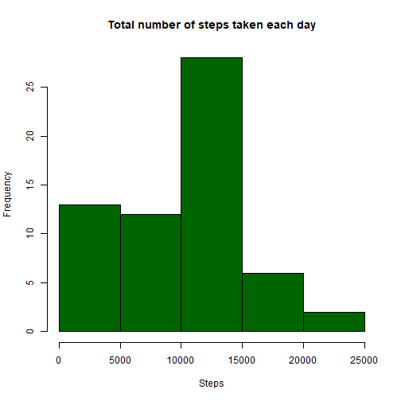
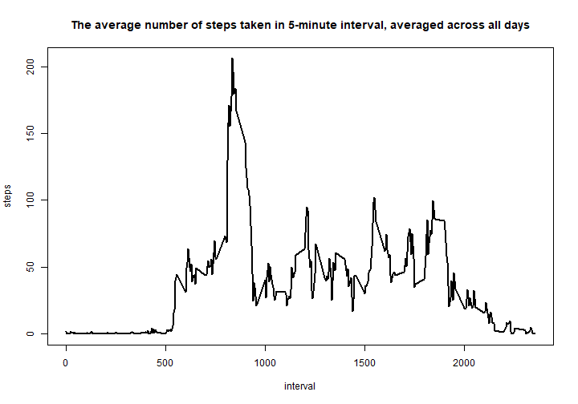
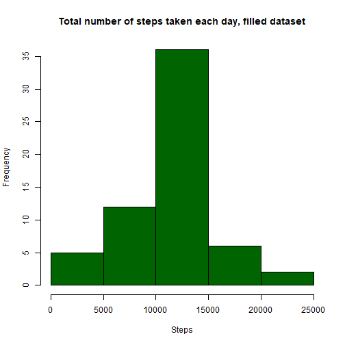
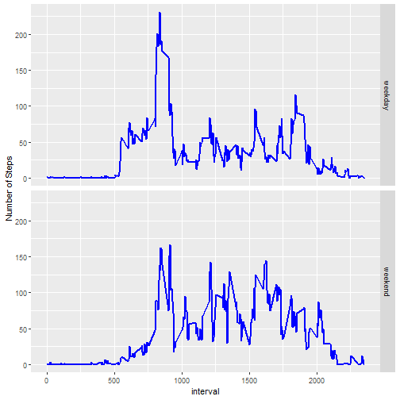

# Title: This is CourseProject1 for Reproducible Research

## Loading and preprocessing the data


```r
if(!file.exists("activity.csv")){
  file.dir <- "https://d396qusza40orc.cloudfront.net/repdata%2Fdata%2Factivity.zip"
  download.file(file.dir,"Project1Data.zip")
  unzip("./Project1Data.zip")
}
activity <- read.csv("activity.csv",header = TRUE,sep=",",na.strings = "NA")
head(activity)
```

```
##   steps       date interval
## 1    NA 2012-10-01        0
## 2    NA 2012-10-01        5
## 3    NA 2012-10-01       10
## 4    NA 2012-10-01       15
## 5    NA 2012-10-01       20
## 6    NA 2012-10-01       25
```

```r
# transform the date, interval to date+time
activity$datetime <- strptime(paste(activity$date," ",floor(activity$interval/100),":",((activity$interval) %% 100),":0",sep=""),"%Y-%m-%d %H:%M:%S")
head(activity)
```

```
##   steps       date interval            datetime
## 1    NA 2012-10-01        0 2012-10-01 00:00:00
## 2    NA 2012-10-01        5 2012-10-01 00:05:00
## 3    NA 2012-10-01       10 2012-10-01 00:10:00
## 4    NA 2012-10-01       15 2012-10-01 00:15:00
## 5    NA 2012-10-01       20 2012-10-01 00:20:00
## 6    NA 2012-10-01       25 2012-10-01 00:25:00
```
## What is mean total number of steps taken per day?

```r
library(reshape2)
# Calculate the total number of steps taken per day
activity.day <- melt(data = activity, id=c("date"), measure.vars = "steps")
activity.day <- dcast(data = activity.day, date ~ variable, sum,na.rm=TRUE)

# Make a histogram of the total number of steps taken each day
hist(activity.day$steps, col="darkgreen",
     xlab = "Steps",main="Total number of steps taken each day")
```



```r
# Calculate and report the mean and median of the total number of steps taken per day
sprintf("Mean total number of steps taken per day is %.4f", mean(activity.day$steps))
```

```
## [1] "Mean total number of steps taken per day is 9354.2295"
```

```r
sprintf("Median total number of steps taken per day is %d", median(activity.day$steps))
```

```
## [1] "Median total number of steps taken per day is 10395"
```
## What is the average daily activity pattern?


```r
# Make a time series plot (i.e. type = "l") of the 5-minute interval (x-axis) and the average number of steps taken, averaged across all days (y-axis)

# calculate the average number of steps taken, averaged across all days
activity.interval <- melt(data = activity, id=c("interval"), measure.vars = "steps")
activity.interval <- dcast(data = activity.interval, interval ~ variable, mean,na.rm=TRUE)
with(activity.interval,
     plot(interval,steps,type="l",lwd=2,
          main="The average number of steps taken in 5-minute interval, averaged across all days"))
```



```r
# Which 5-minute interval, on average across all the days in the dataset, contains the maximum number of steps?
interval.max <- which(activity.interval$steps==max(activity.interval$steps))
sttime.intervalmax <- activity.interval$interval[interval.max]
if(interval.max<nrow(activity.interval)){
  endtime.intervalmax <- activity.interval$interval[interval.max+1]
}else{
  endtime.intervalmax <- 2400
}
sprintf("No.%d 5-minute interval, time %d:%d to %d:%d contains the maximum number of steps, on average across all the days in the dataset", interval.max,floor(sttime.intervalmax/100),(sttime.intervalmax %% 100),floor(endtime.intervalmax/100),(endtime.intervalmax %% 100))
```

```
## [1] "No.104 5-minute interval, time 8:35 to 8:40 contains the maximum number of steps, on average across all the days in the dataset"
```
## Imputing missing values
Note that there are a number of days/intervals where there are missing values (coded as NA). The presence of missing days may introduce bias into some calculations or summaries of the data.


```r
# Calculate and report the total number of missing values in the dataset (i.e. the total number of rows with NAs)
loc.missing <- which(is.na(activity$steps))
sprintf("The total number of missing values in the dataset (i.e. the total number of rows with NAs) is %d", length(loc.missing))
```

```
## [1] "The total number of missing values in the dataset (i.e. the total number of rows with NAs) is 2304"
```

```r
# Devise a strategy for filling in all of the missing values in the dataset. The strategy does not need to be sophisticated. For example, you could use the mean/median for that day, or the mean for that 5-minute interval, etc.
print("In the project, using the mean for that corresponding 5-minute interval to fill in all the missing values.")
```

```
## [1] "In the project, using the mean for that corresponding 5-minute interval to fill in all the missing values."
```

```r
# Create a new dataset that is equal to the original dataset but with the missing data filled in.

activity.fill <- activity
activity.fill$steps[loc.missing] <-   activity.interval$steps[match(activity$interval[loc.missing],activity.interval$interval)]
# Make a histogram of the total number of steps taken each day and Calculate and report the mean and median total number of steps taken per day. 
activityfill.day <- melt(data = activity.fill, id=c("date"), measure.vars = "steps")
activityfill.day <- dcast(data = activityfill.day, date ~ variable, sum,na.rm=TRUE)
hist(activityfill.day$steps, col="darkgreen",
     xlab = "Steps",main="Total number of steps taken each day, filled dataset")
```



```r
sprintf("In filled dataset, mean total number of steps taken per day is %.4f", mean(activityfill.day$steps))
```

```
## [1] "In filled dataset, mean total number of steps taken per day is 10766.1887"
```

```r
sprintf("In filled dataset, median total number of steps taken per day is %.4f", median(activityfill.day$steps))
```

```
## [1] "In filled dataset, median total number of steps taken per day is 10766.1887"
```

```r
# Do these values differ from the estimates from the first part of the assignment? What is the impact of imputing missing data on the estimates of the total daily number of steps?

print("The values with inputing missing data are larger than thoes in first part. It is because that filling the missing values will increase the total daily number of steps.")
```

```
## [1] "The values with inputing missing data are larger than thoes in first part. It is because that filling the missing values will increase the total daily number of steps."
```
## Are there differences in activity patterns between weekdays and weekends?
For this part the weekdays() function may be of some help here. Use the dataset with the filled-in missing values for this part.


```r
library(plyr)
library(ggplot2)
# Create a new factor variable in the dataset with two levels - "weekday" and "weekend" indicating whether a given date is a weekday or weekend day.
activity.fill$weekday <- factor(weekdays(activity.fill$datetime)) 
activity.fill$weekday <- revalue(activity.fill$weekday, c( "Monday"="weekday","Tuesday"="weekday","Wednesday"="weekday","Thursday"="weekday","Friday"="weekday","Saturday"="weekend","Sunday"="weekend"))

# Make a panel plot containing a time series plot (i.e. type = "l") of the 5-minute interval (x-axis) and the average number of steps taken, averaged across all weekday days or weekend days (y-axis).
activityfill.weekday <- melt(data = activity.fill, id=c("weekday","interval"), measure.vars = "steps")
activityfill.weekday <- dcast(data = activityfill.weekday, weekday + interval ~ variable, mean,na.rm=TRUE)
g <- ggplot(data=activityfill.weekday,aes(x=interval,y=steps))+geom_line(size=1,color="blue")+labs(y="Number of Steps")
g + facet_grid(weekday ~ .)
```




